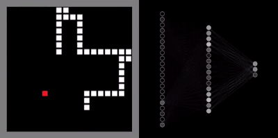

# Snake
> Reti neurali che giocano a snake addestrate da algoritmi genetici

<p align = "center">
   
</p>


Un progetto personale fatto da Antonio Scardavilli e Ivan Valluzzi, consistente nell'addestrare reti neurali per giocare al gioco "Snake"

Questo progetto contiene:
- Il gioco di Snake
- Un modulo che implementa l'algoritmo genetico
- Un modulo che implementa la rete neurale
- Un file principale con esempi

L'algoritmo genetico è parallelizzato per la sua parte principale (valutazione dei serpenti) usando multiprocessing e ``joblib``.

## Installazione

E' stato utilizzato Phyton 3 per questo progetto e non siamo sicuri che le versioni precedenti siano compatibili

Librerie necessarie per eseguire il progetto:

{`` joblib``, `` numpy``, `` numba``, `` pygame``}

## Utilizzo

Troverai alcuni esempi pronti per l'esecuzione nel file `` main.py``.

Puoi provare a:
- Giocare a Snake
- Addestrare le tue reti neurali (può volerci del tempo per ottenere buoni risultati)
- Eseguire una partita giocata da reti neurali che abbiamo addestrato e selezionato perché più interessanti.

Tutto è spiegato nel file, basta decommentare le parti che vuoi eseguire, quindi vai al terminale e esegui:
```sh
python main.py
```

## Documentazione

Per visionare la documentazione del progetto aprire il file:

```sh
doc/html/index.html
```

